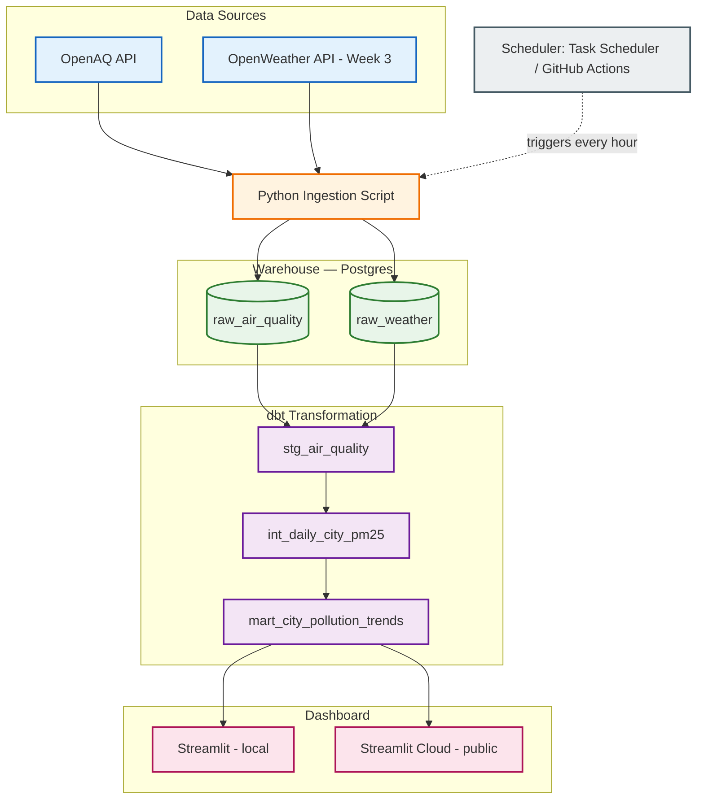

# AirWatch — India Air Quality Pipeline

> Automated data pipeline ingesting real PM2.5 readings from government sensor networks across 5 Indian cities — hourly, end-to-end, from raw API to analyzed dashboard.

**Author:** Abhijeet Sirohi | B.Tech CSE-AIDE, 2nd Year  
**Segment:** Foundations of Data Engineering | **Problem:** H1 — APIs to Warehouse  
**Stack:** Python · PostgreSQL · dbt · Streamlit · Task Scheduler · GitHub Actions

---

## System Architecture



---

## What This Does

India's air quality data is publicly available but practically inaccessible — scattered across hundreds of individual sensor stations, updated constantly, with no historical record unless someone builds one. AirWatch builds that record.

Every hour, a scheduled Python script queries OpenAQ's API for the latest PM2.5 reading from active government monitoring stations in Delhi, Mumbai, Bengaluru, Kolkata, and Chennai. Each reading is stored as a raw row in Postgres. dbt then rebuilds three transformation layers on top: a staging model that cleans column names and types, an intermediate model that computes daily averages and peaks per city, and a mart that flags likely sensor errors and presents clean, query-ready data to the dashboard.

**By the numbers (as of Week 1):**
- 5 cities tracked, 1 pollutant (PM2.5), hourly cadence
- 3 dbt models, 5 passing data quality tests
- 1 real sensor anomaly found and formally flagged (Mumbai station reporting 900+ µg/m³ — documented in ADR-003)
- 20+ commits across 2 weeks of active development

**Week 3 addition:** OpenWeather joins as a second source — same warehouse, same dbt project — enabling `mart_pollution_weather_correlation`, which answers: *does wind speed or humidity predict next-day PM2.5 spikes?*

---

## Demo

| | Link |
|---|---|
| Live dashboard | *(deploying Week 4 — Streamlit Community Cloud)* |
| Loom walkthrough | *(recording Week 4)* |

---

## Project Structure

```
airwatch/
├── airwatch_dbt/               # dbt project
│   ├── models/
│   │   ├── staging/            # stg_air_quality + sources.yml + schema.yml
│   │   ├── intermediate/       # int_daily_city_pm25
│   │   └── marts/              # mart_city_pollution_trends
│   └── tests/                  # 2 custom data quality tests
├── docs/
│   ├── design_doc.md           # 1-page design doc
│   └── adr/                    # Architecture Decision Records
├── dashboard.py                # Streamlit dashboard
├── fetch_air_quality.py        # Ingestion script (OpenAQ)
├── find_stations.py            # Station discovery utility
├── .env                        # API keys — gitignored, never committed
├── .gitignore
└── README.md
```

---

## Tech Stack

| Component | Choice | Reasoning |
|---|---|---|
| Primary source | OpenAQ API | Real government sensor data — not synthetic, not estimated |
| Second source (Week 3) | OpenWeather API | Weather drives pollution; enables correlation analysis |
| Ingestion | Python + `requests` | Standard, readable, directly teachable |
| Scheduling (local) | Windows Task Scheduler | Hourly runs while laptop is active |
| Scheduling (deployed) | GitHub Actions (cron) | Free for public repos, runs independent of laptop state |
| Warehouse (local) | PostgreSQL 18 (native) | Full SQL, plugs directly into dbt, transferable skill |
| Warehouse (deployed) | Supabase free tier | Permanently free Postgres, no trial clock, no card |
| Transformation | dbt-core + dbt-postgres | Industry standard for staging → marts pattern |
| Dashboard (local) | Streamlit | Python-native, fast iteration, clean output |
| Dashboard (deployed) | Streamlit Community Cloud | Free permanent hosting for public apps |

*Docker Desktop has a virtualization conflict on this machine (WSL2/Hyper-V). Postgres and scheduling run natively. Docker Compose containerization is tracked in ADR-001 and planned before Milestone 1.*

---

## Quickstart

**Prerequisites:** Python 3.11+, PostgreSQL 18 running on port 5432, Git

```bash
git clone https://github.com/Abhijeet-max01/airwatch.git
cd airwatch
pip install -r requirements.txt
```

Create a `.env` file in the root — gitignored, never committed:
```
OPENAQ_API_KEY=your_openaq_api_key_here
```

```bash
# Ingest latest PM2.5 readings for all 5 cities
python fetch_air_quality.py

# Build dbt transformation models
cd airwatch_dbt
dbt run

# Run all 5 data quality tests
dbt test

# Launch dashboard locally
cd ..
streamlit run dashboard.py
# Opens at http://localhost:8501
```

---

## Data Sources

| Source | Endpoint | Field | Cities | Cadence |
|---|---|---|---|---|
| OpenAQ | `/v3/locations/{id}/latest` | PM2.5 µg/m³ | Delhi, Mumbai, Bengaluru, Kolkata, Chennai | Hourly |
| OpenWeather | `/data/2.5/weather` | Temp, humidity, wind | Same 5 cities | Hourly (Week 3) |

**Station selection methodology:** queried the OpenAQ API for active PM2.5 sensors (parameter ID 2) within 25km of each city centre, filtered by `datetimeLast` to confirm recent activity. Several stations were ruled out for stale data (some last reported in 2018-2022). Final station IDs were verified by calling `/latest` and confirming a current reading before committing.

---

## Data Quality

AirWatch found a real anomaly during development: Mumbai's Sion station (ID 6967) has multiple PM2.5 sensors — one active, one that stopped reporting in 2022. The initial ingestion script grabbed the dead sensor by picking the first match. Fixed by selecting the sensor with the most recent `datetime.utc` among all PM2.5 sensors at the station.

A second anomaly: the active Sion sensor consistently reports 900+ µg/m³ — physically implausible for PM2.5 (WHO safe limit is 5 µg/m³ annual average; even Delhi's worst winter days rarely exceed 400). The mart layer flags these rows with `likely_sensor_error = true`. Raw data is preserved; flagged rows are excluded from dashboard averages.

Custom dbt tests:
- `test_no_negative_pm25.sql` — PM2.5 cannot be negative
- `test_flag_consistency.sql` — verifies flagging logic is internally consistent

All 5 tests passing.

---

## ADRs

Decision records in [`/docs/adr/`](docs/adr/):

- [ADR-001](docs/adr/ADR-001-postgres.md) — PostgreSQL as the warehouse
- [ADR-002](docs/adr/ADR-002-data-sources.md) — OpenAQ + OpenWeather as sources
- [ADR-003](docs/adr/ADR-003-data-quality.md) — Sensor anomaly handling strategy

---

## Mini-Extension (Week 3)

Adding OpenWeather as a second source — same Postgres warehouse, same dbt project, one new ingestion connector. This is not just a second API call: it enables `mart_pollution_weather_correlation`, which answers whether wind speed or humidity predicts next-day PM2.5 spikes. The extension is the analytical payoff the pipeline was designed for from the start.

---

## Known Limitations

- **Docker:** virtualization conflict on this machine. Native Postgres substituted for local development. Containerization planned before Milestone 1 (19 July). Tracked in ADR-001.
- **Task Scheduler:** only triggers while laptop is on and user is logged in. GitHub Actions handles this for the deployed version.
- **Mumbai sensor:** Sion station reports anomalous values. Flagged in mart layer, excluded from averages. Full analysis in ADR-003.
- **Station coverage:** Kolkata's chosen station updates less frequently than the others.

---

## What I Learned This Week

- Real APIs are not clean. Mumbai's station has multiple PM2.5 sensors — an active one and a dead 2022 one. The ingestion script originally grabbed the dead one by taking the first match. Fixed by collecting all PM2.5 sensors and selecting the one with the most recent timestamp.
- `dbt run` and `dbt test` are separate operations by design. Run builds views; test checks them. Understanding this made the whole transformation layer click.
- Postgres running natively and dbt pointing at it are independent things. dbt is a build system for SQL — it does not care how the database is running underneath.
- Consistent commits matter more than large ones. Thirty commits over two weeks tell a story that one big commit at the end cannot.
- Windows PATH issues are a real, recurring pattern — every major tool (Python, Git, Postgres, dbt) needed the same fix: add its `bin` or `Scripts` folder to the system PATH variable.

---

## 3rd Year Roadmap

See [`docs/roadmap_3rd_year.md`](docs/roadmap_3rd_year.md) *(Week 4)*

Next steps: next-day PM2.5 forecasting model on the existing warehouse, OpenAQ WebSocket streaming to replace polling, data contracts per source, persistent public deployment. The 3rd year internship equivalent is B1 — Unified Commerce Lakehouse: same multi-source batch + streaming pattern, larger scale.

---

## License and Acknowledgements

Data from [OpenAQ](https://openaq.org) (US Public Domain) and OpenWeather (free tier).  
Built during 2nd Year Internship — Foundations of Data Engineering, B.Tech CSE-AIDE, June–July 2026.