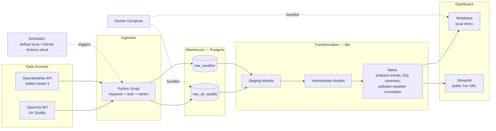

# Design Doc — AirWatch

**Author:** Abhijeet Sirohi
**Segment:** Foundations of Data Engineering
**Problem Statement:** H1 — APIs to Warehouse (official catalog problem)
**Date:** 24 June 2026

---

## 1. One-Line Description

A scheduled pipeline that ingests real air quality data (PM2.5, PM10, NO2, O3) from OpenAQ for five major Indian cities, lands it in a Postgres warehouse, transforms it with dbt into pollution-trend models, and surfaces it on a dashboard — with weather data added as a second source to explore what drives pollution spikes.

## 2. Problem Statement (why this, why me)

Air quality is a real, ongoing public health issue in Indian cities, and I wanted my first data engineering project to work with genuine, meaningful data rather than a toy dataset. Pairing pollution data with weather data lets me ask a real analytical question — does humidity, wind speed, or temperature correlate with pollution spikes the next day — instead of just moving numbers from one place to another. This project is also the foundation I plan to build on in 3rd year, eventually adding a forecasting layer once I'm ready to bring AI/ML into it.

## 3. Data Source

- **Primary API:** OpenAQ — real government/sensor-network air quality data (free, registration required)
  - Pollutants tracked: PM2.5, PM10, NO2, O3
  - Cities tracked: Delhi, Mumbai, Bengaluru, Kolkata, Chennai
- **Second source (mini-extension, Week 3):** OpenWeather — temperature, humidity, wind speed for the same five cities
- **Auth:** both require a free API key via registration
- **Call frequency (Week 1):** manual / on-demand → moves to scheduled (hourly) by Week 2

## 4. Architecture (Week 1 → Week 4 view)

## 5. Tech Stack

| Component | Choice | Where it runs | Why |
|---|---|---|---|
| Primary data source | OpenAQ API | — | Real government/sensor air quality data, genuine public-health relevance |
| Second source (Week 3) | OpenWeather API | — | Natural pairing — explains why pollution spikes happen |
| Ingestion language | Python (`requests`) | Local (dev) | Industry standard, already learning it |
| Scheduling (Week 1) | Manual script run | Local | Prove the flow works before adding orchestration complexity |
| Scheduling (Week 2-3, learning) | Apache Airflow (Docker) | Local only | Most in-demand orchestration tool — learn it hands-on, no cloud cost |
| Scheduling (live/deployed version) | GitHub Actions scheduled workflow | Cloud — free forever, public repo | Real, recognizable orchestration pattern; zero hosting cost |
| Warehouse | PostgreSQL | Local (Docker) for dev → Supabase free tier for the live version | Permanently free, no card, no trial clock |
| Transformation | dbt-core + dbt-postgres | Local + against Supabase | Industry-standard staging → marts pattern |
| Dashboard (dev/demo recording) | Metabase (Docker) | Local only | No-code, great for Friday demos and the Loom |
| Dashboard (the public "live URL") | Streamlit app | Streamlit Community Cloud — free forever, public app | Lightweight, no server to keep paying for |
| Containerization | Docker Compose | Local | Bundles Postgres + Airflow + Metabase for local dev/learning |

## 6. Week 1 Scope (the "skinny slice")

- [ ] Register for OpenAQ API access (free)
- [ ] Pull recent measurements for Delhi, Mumbai, Bengaluru, Kolkata, and Chennai, print to console
- [ ] Handle pagination + rate limits properly
- [ ] Store raw response in a `raw_air_quality` Postgres table running in Docker
- [ ] Run a `SELECT * FROM raw_air_quality;` and confirm real rows exist
- [ ] This is the entire Friday Demo #1 bar — data flowing, end to end, however ugly.

## 7. The Mini-Extension (Week 3 — official pattern match)

Per the H1 spec: "Add a second source to the pipeline — same destination, same dbt project, just one more connector." Adding OpenWeather does exactly this: same Postgres warehouse, same dbt project, and it unlocks a real analytical question — does humidity, wind speed, or temperature correlate with next-day pollution spikes across the five tracked cities? A `mart_pollution_weather_correlation` model becomes the centerpiece of this extension.

## 8. Risks / Open Questions

- [ ] Confirm OpenAQ has active stations for all five chosen cities — coverage can be patchy for smaller monitoring networks
- [ ] Airflow has a real learning curve — flagging now that Week 2 may need extra mentor time here
- [ ] Docker Desktop currently has a virtualization setup issue on my machine — being debugged in parallel, with a non-Docker Postgres fallback as a backup plan if it isn't resolved in time

## 9. Definition of Done (Milestone 1 — Alpha, due 19 July)

Live dashboard, reachable by URL, showing real pollution trends for Delhi, Mumbai, Bengaluru, Kolkata, and Chennai, fed by an Airflow-scheduled (local) / GitHub Actions-scheduled (cloud) pipeline, with the data modeled through a working dbt project (5+ models) and at least 1 passing test.

## 10. 3rd-Year Extension Path (per Doc 02's own H1 roadmap)

- Add a next-day pollution forecasting model on top of the same warehouse — the bridge into AI/ML, built on a DE foundation instead of starting from zero
- Add a public-health alert layer for hazardous AQI days (real public-safety value)
- Add data contracts + a quality framework (Great Expectations) as sensor data scales
- Becomes a credible "Environmental Health Intelligence" platform for the 3rd-year internship